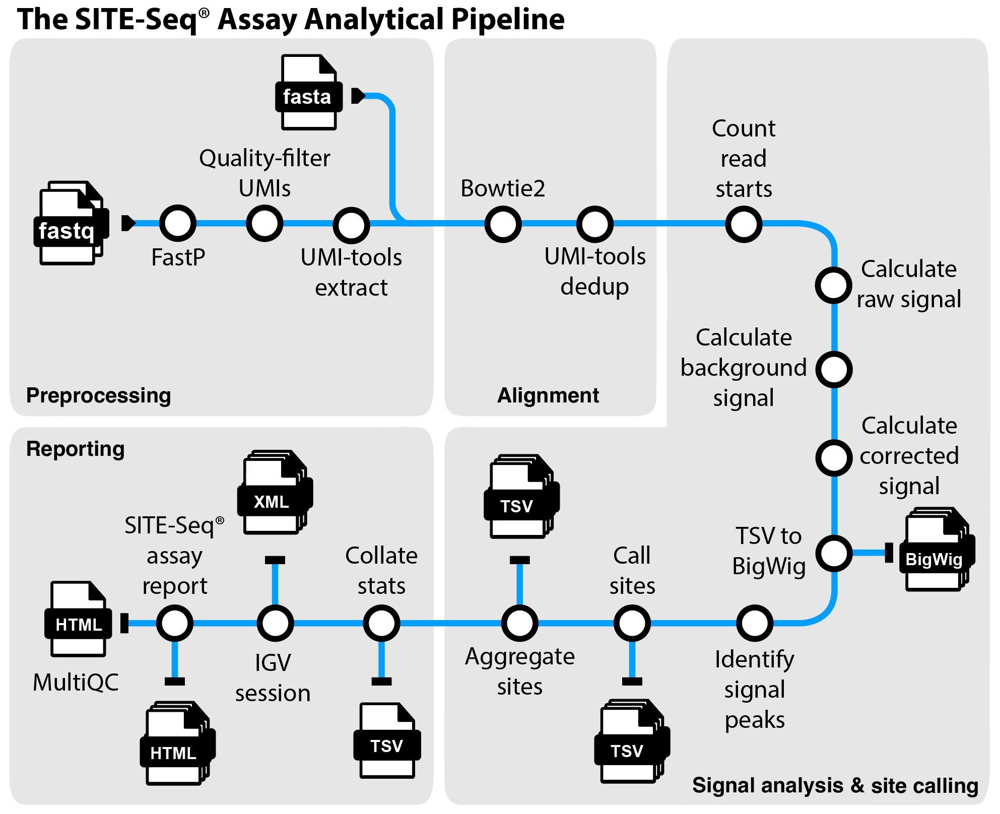
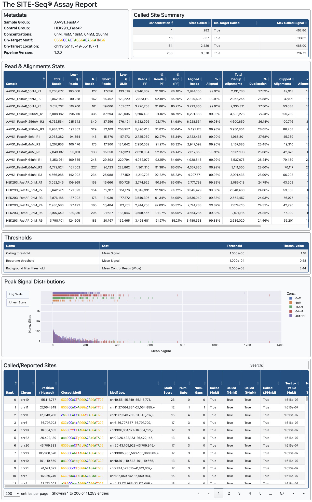

# SITE-Seq® Assay Analysis Pipeline

[](https://www.nextflow.io/)
[](https://www.docker.com/)

<!-- TODO: Update Zenodo badge with DOI -->
<!--[](https://doi.org/10.5281/zenodo.1400710)-->

## Table of Contents

- [Introduction](#introduction)
- [Documentation](#documentation)
- [Dependencies](#dependencies)
- [Usage](#usage)
- [Pipeline Output](#pipelineoutput)
- [Citations](#citations)

## Introduction<a name="introduction"></a>

The SITE-Seq® assay is a multistep biochemical assay that identifies on-and off-target CRISPR-Cas cleavage sites. The method involves tagging, enriching, sequencing, and mapping genomic DNA to a reference genome to identify cleavage sites that could lead to off-target editing in cells. The SITE-Seq assay analysis pipeline is a Nextflow pipeline that processes and analyzes data generated by the SITE-Seq assay to identify CRISPR-mediated cleavage sites. The pipeline takes a samplesheet and FASTQ files as input, performs quality control (QC), UMI extraction, genome alignment, read deduplication, alignment processing, and site calling to produce a list of on-target and candidate off-target sites with various reports.



1. Read QC ([`FastP`](https://github.com/OpenGene/fastp))
2. Quality-filter UMIs
3. Extract UMIs ([`UMI-tools`](https://github.com/CGATOxford/UMI-tools))
4. Genome alignment ([`Bowtie2`](https://bowtie-bio.sourceforge.net/bowtie2/index.shtml))
5. Deduplicate alignments ([`UMI-tools`](https://github.com/CGATOxford/UMI-tools))
6. Count read starts
7. Merge read starts
8. Calculate raw signals
9. Calculate raw background signals
10. Calculate corrected signals
11. Identify signal peaks
12. Call sites
13. Aggregate sites
14. Create the SITE-Seq® assay HTML report
15. Create IGV session
16. Present QC for raw read, alignment, and deduplication ([`MultiQC`](http://multiqc.info/))

## Documentation<a name="documentation"></a>

Pages containing detailed documentation are linked below.

- [Usage](docs/usage.md)
  - An overview of how the pipeline works, running it, and a description of available command-line options.
- [Output](docs/output.md)
  - An overview of results generated by the pipeline and how to interpret them.
- [SITE-Seq® Assay Report](docs/site-seq_assay_report.md)
  - A detailed breakdown of the core output of the pipeline, the SITE-Seq assay report.
- [Site-Calling Algorithm](docs/algorithm.md)
  - A description of the site-calling algorithm.
- [Recommendations & Troubleshooting](docs/recommendations_and_troubleshooting.md)
  - Troubleshooting tips and recommendations for running the assay and pipeline.

## Dependencies<a name="dependencies"></a>

- [Nextflow](https://www.nextflow.io/) version ≥24.04.2
- [Docker](https://www.docker.com/) version ≥20
- Additional software packages are installed automatically during build. See [CITATIONS.md](CITATIONS.md) for a complete list.

## Usage<a name="usage"></a>

> **Note:**
> The SITE-Seq assay analysis pipeline runs on [Nextflow](https://www.nextflow.io/), a workflow tool to run tasks across different compute infrastructures in a portable manner. It uses Docker containers making installation trivial and results highly reproducible. If you are new to Nextflow, please refer to [this page](https://nf-co.re/docs/usage/installation) on how to get started. We recommend testing your installation using `-profile test` before running the pipeline with real data.

First, clone this repository, build the necessary Docker image, and run the test profile to test your installation:

```bash
git clone https://github.com/Caribou-Biosciences/nf-SITE-Seq.git
cd nf-SITE-Seq
bash toolkits/build_image.sh
nextflow run main.nf -profile test,docker --outdir example_results
```

You only need to build the Docker image once upon installation and once before running a new release of the pipeline. The test profile runs the pipeline on a subset of sequencing reads from a SITE-Seq assay run used to detect on- and off-target cleavage using Cas9 with an AAVS1 targeting guide. Please note that the majority of reads were removed from these FASTQ files to minimize download size, but the resulting report is similar to what would be seen in a normal experiment.

To run the pipeline on your own data, prepare a samplesheet with your input data that looks as follows:

```csv
sample_group,control_group,concentration,replicate,on_target_motif,on_target_location,fastq_1,fastq_2
CONTROL,,0,1,,,/data/CONTROL_Rep1_R1.fastq.gz,/data/CONTROL_Rep1_R2.fastq.gz
CONTROL,,0,2,,,/data/CONTROL_Rep2_R1.fastq.gz,/data/CONTROL_Rep2_R2.fastq.gz
CONTROL,,0,3,,,/data/CONTROL_Rep3_R1.fastq.gz,/data/CONTROL_Rep3_R2.fastq.gz
AAVS1,CONTROL,16,1,GGGGCCACTAGGGACAGGATNGG,chr19:55115749-55115771,/data/AAVS1_16_Rep1_R1.fastq.gz,/data/AAVS1_16_Rep1_R2.fastq.gz
AAVS1,CONTROL,16,2,GGGGCCACTAGGGACAGGATNGG,chr19:55115749-55115771,/data/AAVS1_16_Rep2_R1.fastq.gz,/data/AAVS1_16_Rep2_R2.fastq.gz
AAVS1,CONTROL,16,3,GGGGCCACTAGGGACAGGATNGG,chr19:55115749-55115771,/data/AAVS1_16_Rep3_R1.fastq.gz,/data/AAVS1_16_Rep3_R2.fastq.gz
AAVS1,CONTROL,128,1,GGGGCCACTAGGGACAGGATNGG,chr19:55115749-55115771,/data/AAVS1_128_Rep1_R1.fastq.gz,/data/AAVS1_128_Rep1_R2.fastq.gz
AAVS1,CONTROL,128,2,GGGGCCACTAGGGACAGGATNGG,chr19:55115749-55115771,/data/AAVS1_128_Rep2_R1.fastq.gz,/data/AAVS1_128_Rep2_R2.fastq.gz
AAVS1,CONTROL,128,3,GGGGCCACTAGGGACAGGATNGG,chr19:55115749-55115771,/data/AAVS1_128_Rep3_R1.fastq.gz,/data/AAVS1_128_Rep3_R2.fastq.gz
FANCF,CONTROL,16,1,GGAATCCCTTCTGCAGCACCNGG,chr11:22625786-22625808,/data/FANCF_16_Rep1_R1.fastq.gz,/data/FANCF_16_Rep1_R2.fastq.gz
FANCF,CONTROL,16,2,GGAATCCCTTCTGCAGCACCNGG,chr11:22625786-22625808,/data/FANCF_16_Rep2_R1.fastq.gz,/data/FANCF_16_Rep2_R2.fastq.gz
FANCF,CONTROL,16,3,GGAATCCCTTCTGCAGCACCNGG,chr11:22625786-22625808,/data/FANCF_16_Rep3_R1.fastq.gz,/data/FANCF_16_Rep3_R2.fastq.gz
FANCF,CONTROL,128,1,GGAATCCCTTCTGCAGCACCNGG,chr11:22625786-22625808,/data/FANCF_128_Rep1_R1.fastq.gz,/data/FANCF_128_Rep1_R2.fastq.gz
FANCF,CONTROL,128,2,GGAATCCCTTCTGCAGCACCNGG,chr11:22625786-22625808,/data/FANCF_128_Rep2_R1.fastq.gz,/data/FANCF_128_Rep2_R2.fastq.gz
FANCF,CONTROL,128,3,GGAATCCCTTCTGCAGCACCNGG,chr11:22625786-22625808,/data/FANCF_128_Rep3_R1.fastq.gz,/data/FANCF_128_Rep3_R2.fastq.gz
```

Each row represents a FASTQ file (single-end) or a pair of FASTQ files (paired-end). Rows with the same `sample_group`, `concentration`, and `replicate` are considered technical replicates and merged automatically. An [example samplesheet](assets/test_data/samplesheet.csv) has been provided with the pipeline. [See the usage documentation for an explanation of each samplesheet column](docs/usage.md#full-samplesheet).

Now, you can run the pipeline using:

```bash
nextflow run main.nf \
   --input samplesheet.csv \
   --outdir <OUTDIR> \
   --fasta /path/to/genome.fasta \
   -profile docker
```

> [!WARNING]
> Please provide pipeline parameters via the CLI or Nextflow `-params-file` option. Custom config files including those provided by the `-c` Nextflow option can be used to provide any configuration _**except for parameters**_; see [docs](https://nf-co.re/docs/usage/getting_started/configuration#custom-configuration-files).

For more details and further functionality, including definitions of each samplesheet column and all pipeline parameters, please refer to the [usage documentation](docs/usage.md).

## Pipeline output<a name="pipelineoutput"></a>

For more details about the output files and reports, please refer to the [output documentation](docs/output.md). There is also a dedicated page explaining the core output of the pipeline, the [SITE-Seq® assay report](docs/site-seq_assay_report.md). Below is a screenshot of an example report for an AAVS1 guide.



## Citations<a name="citations"></a>

<!-- TODO nf-core: Add citation for pipeline after first release. Uncomment lines below and update Zenodo doi and badge at the top of this file. -->
<!-- If you use Caribou-Biosciences/nf-SITE-Seq for your analysis, please cite it using the following doi: [10.5281/zenodo.XXXXXX](https://doi.org/10.5281/zenodo.XXXXXX) -->

An extensive list of references for the tools used by the pipeline can be found in the [`CITATIONS.md`](CITATIONS.md) file.

This pipeline uses code and infrastructure developed and maintained by the [nf-core](https://nf-co.re) community.

> **The nf-core framework for community-curated bioinformatics pipelines.**
>
> Philip Ewels, Alexander Peltzer, Sven Fillinger, Harshil Patel, Johannes Alneberg, Andreas Wilm, Maxime Ulysse Garcia, Paolo Di Tommaso & Sven Nahnsen.
>
> _Nat Biotechnol._ 2020 Feb 13. doi: [10.1038/s41587-020-0439-x](https://dx.doi.org/10.1038/s41587-020-0439-x).
