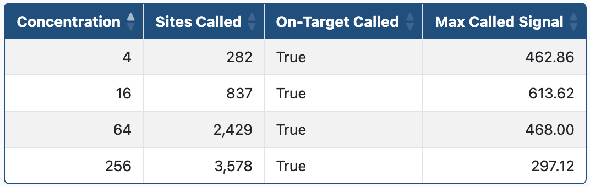
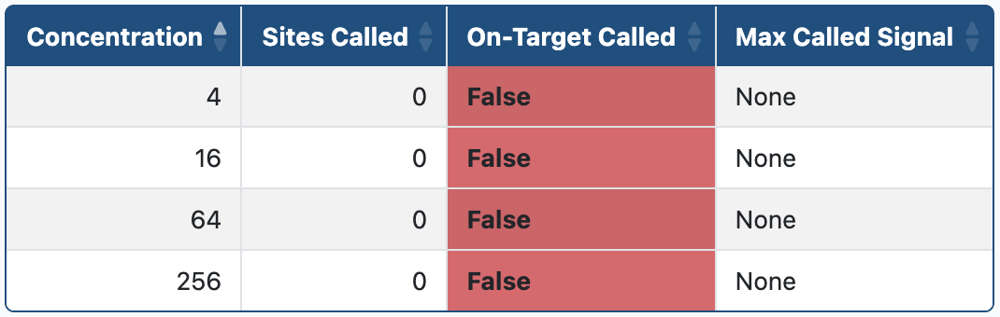
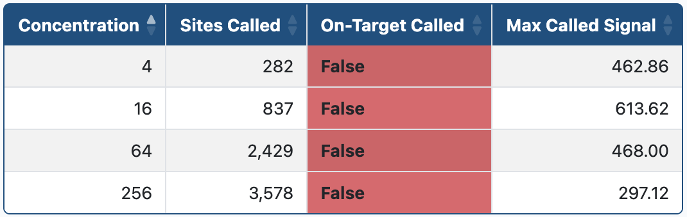
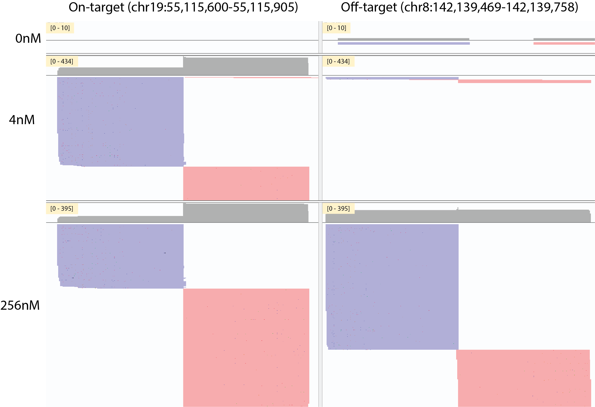

# Caribou-Biosciences/nf-SITE-Seq: Recommendations & Troubleshooting

## Introduction

This document lists recommendations for running the SITE-Seq® assay and analysis pipeline as well as some tips on troubleshooting and evaluating results.

## Table of contents

- [Recommendations](#recommendations)
  - [Replicates](#replicates)
  - [Coverage](#coverage)
  - [Control samples](#control-samples)
  - [Nuclease concentrations](#nuclease-concentrations)
  - [Reference genomes](#reference-genomes)
- [Run evaluation and troubleshooting](#troubleshooting)
  - [Checking coverage and sequencing quality](#troubleshooting-sequencing)
  - [Checking the on-target](#troubleshooting-on-target)
  - [Manually inspecting sites](#troubleshooting-manual-inspection)
  - [Guide contamination](#troubleshooting-guide-contamination)

## Recommendations

### Replicates

We recommend running 3 replicates of each guide and RNP concentration tested along with 3 control replicates. The analysis pipeline will work with an absolute minimum of 1 digested sample and 2 control samples.

### Coverage

We recommend sequencing coverage of 3 to 5 million reads per sample, with a minimum of 2 million reads.

### Control samples

Control samples are used to create a background distribution of detected sites. Therefore, the control wells (RNP concentration = 0 nM) should be generated using the same DNA stock as the digested samples. There must be at least one control replicate for each test replicate, so if the cleavage reactions are run in triplicate, 3 controls must be included. Due to their critical nature, we often run 6 control samples when testing a 96-well plate full of triplicate digestion reactions.

### Nuclease concentrations

The ideal RNP concentration(s) will depend on the goals of your off-target detection strategy. Lower RNP concentrations, e.g. 4 nM, produce site rankings that correlate better with measures of in-cell editing. Higher RNP concentrations, e.g. 64 nM and 256 nM, are more sensitive and detect more biochemical off-target sites. We recommend running one lower RNP concentration, such as 4 nM, and one higher RNP concentration, such as 64 nM, to produce a well-ranked list of sites with high detection sensitivity.

### Reference genomes

We recommend using an ["analysis set" reference genome](https://ftp.ncbi.nlm.nih.gov/genomes/all/GCA/000/001/405/GCA_000001405.15_GRCh38/seqs_for_alignment_pipelines.ucsc_ids/README_analysis_sets.txt) in which alt-scaffolds have been removed. To save on computation time, it's also advisable to provide a pre-built Bowtie2 index using the `--bowtie2_index` pipeline parameter, [see here for a listing of available pre-built indexes](https://benlangmead.github.io/aws-indexes/bowtie). Note that the Bowtie2 index will need to be built from the same reference genome provided by the required `--fasta` parameter. If no pre-built index is available for your genome, you can save the index built by the pipeline using the `--save_bowtie2_index` parameter and use it in subsequent pipeline runs.

## Run Evaluation and Troubleshooting

### Checking coverage and sequencing quality

As with any genomics analysis, a good place to start when evaluating a run of the SITE-Seq® assay is checking overall coverage and sequencing quality. The [MultiQC report](output.md#multiqc) and the [processing metrics TSV](output.md#collate-stats) are good places to check coverage and quality metrics across every sample in the run. Useful metrics are also available in the [SITE-Seq® assay report](./site-seq_assay_report.md#read--alignment-stats). We recommend ensuring that at least 2 million reads are sequenced per sample. The run should be checked for any dropouts as these will likely have negative affects on site detection.

### Checking the on-target

In a successful run of the SITE-Seq® assay the on-target site should be called. This can be easily verified by looking at [the called site summary section of the SITE-Seq® assay report](./site-seq_assay_report.md#called-site-summary):

An obvious failure mode is a lack of biochemical digestion, typified by a lack of any called sites and low signal strength. The example below shows a run in which the RNP was omitted from the reaction:

Another potential failure mode is the misassignment of guide information, typified by a substantial number of called sites, a high maximum site signal, and site sequence motifs that have a high number of mismatches:

Other failures, characterized by an unexpectedly low number of sites, with or without on-target detection may be due to reaction conditions or sequencing coverage. Overall coverage may be increased by resequencing your library, but it's possible that a substantial number of reads are discarded due to low quality, short read length, and other preprocessing filters. Read coverage and filtering can be evaluated by looking at [the read & alignment stats section of the SITE-Seq® assay report](./site-seq_assay_report.md#read--alignment-stats). When no sites are called, A key metric to evaluate is the total number of unique sites observed in the control samples which is available in the read & alignment stats section. If fewer than 100,000 unique sites are observed in the control samples, no sites will be called due to [how p-values are calculated in the site calling algorithm](algorithm.md#report-and-call-sites). This minimum should be comfortably exceeded by obtaining the recommended 2 million reads per sample.

### Manually inspecting sites

It's a good idea to manually inspect the alignments of questionable sites to check whether they are indicative of true biochemical cleavage. A questionable site may have low homology to the on-target or may have a weak signal strength that is near the site calling threshold. The [IGV session output of the pipeline](output.md#igv-session) is very useful for this purpose as it will automatically load alignment tracks for each sample in a sample group, including the control samples. Here is a screenshot of IGV showing the alignments for the on-target of an AAVS1 guide and an off-target site at 0 nM, 4 nM, and 256 nM RNP concentration:

Reads originating within a tight window on both strands in the test samples, and a lack of such reads in the control samples, is generally indicative of true biochemical cleavage.

### Guide contamination

Due to the high sensitivity of the SITE-Seq® assay, it's possible for erroneous sites to be called due to low levels of guide contamination present in the reaction. These sites will typically have low homology to the on-target but have alignment patterns consistent with true biochemical cleavage. Additional evidence of guide contamination is the same site being called across multiple guides, although the exact coordinates may vary slightly. Evidence of on-target cross contamination is most likely caused by the lab process.
