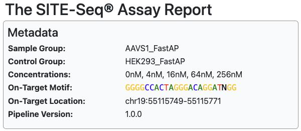
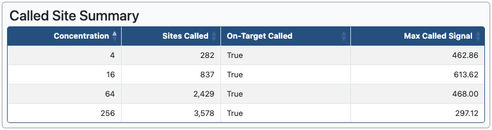
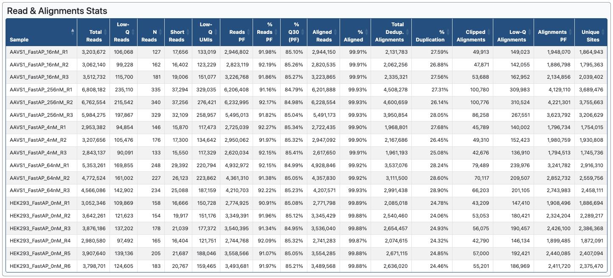
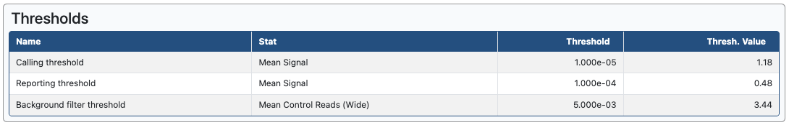
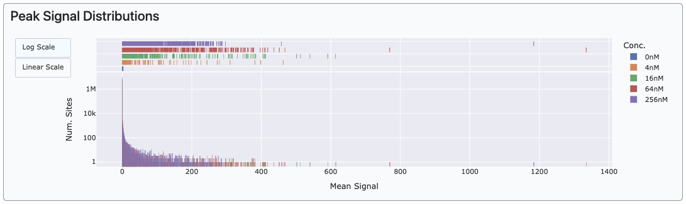
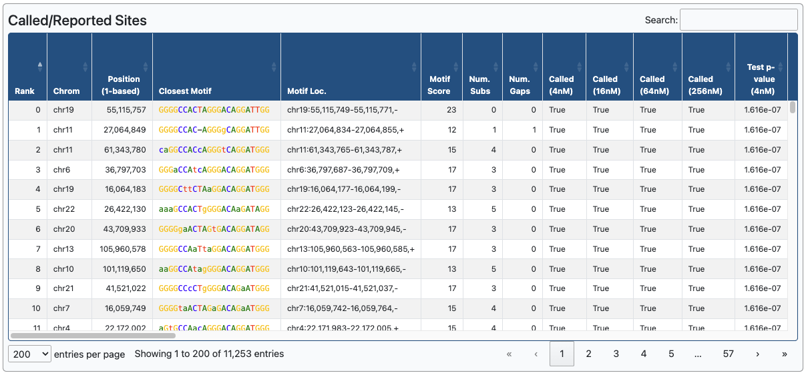

# Caribou-Biosciences/nf-SITE-Seq: The SITE-Seq® assay report

This document describes the structure of the SITE-Seq® assay report in detail. This report is the core output of the analysis pipeline and summarizes key statistics and site calls across all RNP concentrations for a particular sample group in the input. The pipeline generates one report file for each sample group defined in the samplesheet. Each section of the report is described below.

## Sections

- [Metadata](#metadata)
- [Called Site Summary](#called-site-summary)
- [Read and Alignment Stats](#read-and-alignment-stats)
- [Thresholds](#thresholds)
- [Peak Signal Distribution](#peak-signal-distribution)
- [Called\/Reported Sites](#called-reported-sites)

## Metadata

Summarizes metadata about the sample group and the pipeline run.

## Called Site Summary

A table summarizing the number of sites called, whether the on-target was called, and the maximum signal among called sites for each RNP concentration in the sample group. This section is helpful to make sure the analysis was performed correctly and that the run was successful. Note that sites are called in an unbiased manner, so changing the on-target motif will not affect the number of sites called or the maximum signal.

## Read & Alignment Stats

A table of read, UMI, and alignment statistics across all samples in the sample group plus the control samples. Column definitions below:

- **Sample**: Unique identifier for the sample. Incorporates the sample group, the RNP concentration, and the replicate number.
- **Total Reads**: The total number of reads in the FASTQ for this sample.
- **Low-Q Reads**: The number of reads filtered due to low-quality score.
- **N Reads**: The number of reads filtered due to the presence of too many "N" base calls.
- **Short Reads**: The number of reads filtered due to being too short after adapter trimming.
- **Low-Q UMIs**: The number of reads filtered from the input due to having low-quality UMI bases.
- **Reads PF**: The total number of reads that passed primary filtering criteria.
- **% Reads PF**: The percentage of reads that passed primary filtering criteria.
- **% Q30 (PF)**: The percentage of bases with a quality score ≥30 across all reads that passed filtering.
- **Aligned Reads**: The number reads aligned to the reference genome. Only reads that passed filter are included.
- **% Aligned**: The percentage of reads aligned to the reference genome. Calculated as a percentage of the reads passing filtering criteria.
- **Total Dedup. Alignments**: The number of unique alignments after UMI deduplication.
- **% Duplication**: The percentage of alignments that were duplicates.
- **Clipped Alignments**: The number of alignments removed during secondary filtering due to clipping at the start of the read.
- **Low-Q Alignments**: The number of alignments removed during secondary filtering due to low mapping quality.
- **Alignments PF**: The number of alignments passing the secondary filtering criteria.
- **Unique Sites**: The number of genomic locations that had at least one alignment originating from that position.

## Thresholds

A table summarizing key thresholds used in the analyses. Column definitions below:

- **Name**: The name of the threshold.
- **Stat**: The name of the statistic that the threshold is applied to.
- **Threshold**: The p-value threshold defined in the analysis settings.
- **Thresh. Value**: The empirically determined value of the threshold for this analysis.

Here are definitions for the three thresholds displayed in this table:

- **Calling threshold**: The test p-value threshold below which sites are called. This threshold is controlled by the [`--test_pval_calling_thresh`](usage.md#configurable-analysis-parameters-suitable-for-customization) pipeline parameter.
- **Reporting threshold**: The test p-value threshold below which sites are reported, i.e. included in the output. This threshold is controlled by the [`--test_pval_reporting_thresh`](usage.md#configurable-analysis-parameters-suitable-for-customization) pipeline parameter.
- **Background filter threshold**: The control p-value threshold below which sites are filtered out from the output, regardless of their test p-value. This threshold is controlled by the [`--ctrl_noise_pval_calling_thresh`](usage.md#configurable-analysis-parameters-suitable-for-customization) pipeline parameter.

See the [algorithm documentation](algorithm.md#report-and-call-sites) for more information on how p-values are calculated and thresholded.

## Peak Signal Distributions

A plot visualizing the distributions of the signal peaks at each RNP concentration. The y-axis is a log scale by default but can be toggled to be linear. When the assay is run with higher RNP concentrations, there are typically a greater number of sites with stronger signal as shown in the example above.

## Called\/Reported Sites

A table of sites that passed the reporting criteria. These sites are aggregated across RNP concentrations. Column definitions below:

- **Rank**: The rank of the site. If included, the on-target site will have a rank of 0 by definition.
- **Chrom**: The name of the chromosome the site is on.
- **Position**: The position on the chromosome of the site.
- **Closest Motif**: The closest-matching sequence to the on-target motif within close proximity of the site. Uppercase bases match the on-target motif; lowercase bases do not match the on-target motif; dashes represent gaps relative to the on-target motif; bases are color-coded.
- **Motif Loc.**: The genomic coordinates of the closest-matching sequence.
- **Motif Score**: The alignment score of the closest-matching sequence.
- **Num. Subs**: The number of substitutions, i.e. mismatched bases, between the closest-matching sequence and the on-target motif.
- **Num. Gaps**: The number of gaps between the closest-matching sequence and the on-target motif.
- **Called (XnM)**: Whether the site was called at "X" nM RNP concentration. There will be one of these columns per RNP concentration tested.
- **Mean Signal (XnM)**: The mean value of the signal statistic across all replicates at X nM RNP concentration for this site. There will be one of these columns per RNP concentration tested.
- **Signals (XnM)**: The signal statistic of each replicate at X nM RNP concentration for this site. There will be one of these columns per RNP concentration tested.
- **Mean % of Max Peak (XnM)**: The mean of the percentage of maximum peak of this site across all replicates at X nM RNP concentration. There will be one of these columns per RNP concentration tested.
- **% of Max Peaks (XnM)**: This site's signal calculated as a percentage of the maximum signal for each replicate at X nM RNP concentration.
- **Test p-value (XnM)**: The test p-value of this site at "X" nM RNP concentration. There will be one of these columns per RNP concentration tested.
- **Background p-value**: The p-value of the high-background statistical test.
- **Total Reads (XnM)**: The total number of reads counted at this site across all replicates at X nM RNP concentration for this site. If UMIs are enabled (true by default), this represents the total number of deduplicated reads. If normalization is enabled (true by default), this number is normalized per-million reads analyzed in this sample. There will be one of these columns per RNP concentration tested.
- **Reads (XnM)**: The number of reads counted at this site in each replicate at X nM RNP concentration for this site. If UMIs are enabled (true by default), these represent the number of deduplicated reads. If normalization is enabled (true by default), each number is normalized per-million reads analyzed in that sample. There will be one of these columns per RNP concentration tested.
- **Control Reads**: The number of reads counted at this site in each control replicate. If UMIs are enabled (true by default), these represent the number of deduplicated reads. If normalization is enabled (true by default), each number is normalized per-million reads analyzed in that sample.
- **Control Reads (Wide)**: The number of reads counted within a wide window of this site in each control replicate. These values are used to determine whether this site is in a high-background region. If UMIs are enabled (true by default), these represent the number of deduplicated reads. If normalization is enabled (true by default), each number is normalized per-million reads analyzed in that sample.
- **Total Signal (XnM)**: The sum of signal values across all replicates at X nM RNP concentration for this site. There will be one of these columns per RNP concentration tested.
- **Digested (XnM)**: Whether this site was "digested", i.e. passed the statistical test evaluating whether the signal statistics exceeded the site calling threshold, at X nM RNP concentration. There will be one of these columns per RNP concentration tested.
- **High-background**: Whether this site was determined to be in a high-background region as determined by raw signal strength in the control replicates.
